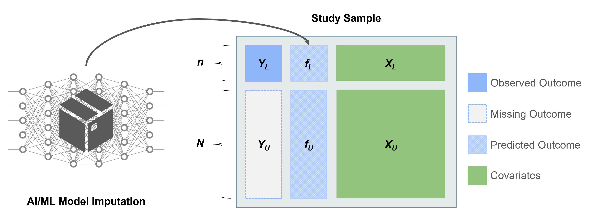

<!-- README.md is generated from README.Rmd. Please edit that file -->

```{r, include = FALSE}
knitr::opts_chunk$set(
  collapse = TRUE,
  comment = "#>",
  message = FALSE,
  warning = FALSE,
  fig.path = "man/figures/README-",
  out.width = "100%"
)
```

# ipd: Inference on Predicted Data

<!-- badges: start -->
[](https://github.com/ipd-tools/ipd/actions/workflows/R-CMD-check.yaml)
[](https://CRAN.R-project.org/package=ipd)
[](https://CRAN.R-project.org/package=ipd)
<!-- badges: end -->

## 

### Overview

`ipd` is an open-source `R` software package for the downstream modeling of an outcome and its associated features where a potentially sizable portion of the outcome data has been imputed by an artificial intelligence or machine learning (AI/ML) prediction algorithm. The package implements several recent proposed methods for inference on predicted data (IPD) with a single, user-friendly wrapper function, `ipd`. The package also provides custom `print`, `summary`, `tidy`, `glance`, and `augment` methods to facilitate easy model inspection.

### Background

Using predictions from pre-trained algorithms as outcomes in downstream statistical analyses can lead to biased estimates and misleading conclusions. The statistical challenges encountered when drawing inference on predicted data (IPD) include:

1.  Understanding the relationship between predicted outcomes and their true, unobserved counterparts.
2.  Quantifying the robustness of the AI/ML models to resampling or uncertainty about the training data.
3.  Appropriately propagating both bias and uncertainty from predictions into downstream inferential tasks.

Several works have proposed methods for IPD, including post-prediction inference (PostPI) by [Wang et al., 2020](https://www.pnas.org/doi/suppl/10.1073/pnas.2001238117), prediction-powered inference (PPI) and PPI++ by [Angelopoulos et al., 2023a](https://www.science.org/doi/10.1126/science.adi6000) and [Angelopoulos et al., 2023b](https://arxiv.org/abs/2311.01453), and post-prediction adaptive inference (PSPA) by [Miao et al., 2023](https://arxiv.org/abs/2311.14220). Each method was developed to perform inference on a quantity such as the outcome mean or quantile, or a regression coefficient, when we have:

1.  A dataset consisting of our outcome and features of interst, where the outcome is only observed for a small 'labeled' subset and missing for a, typically larger, 'unlabeled' subset.
2.  Access to an algorithm to predict the missing outcome in the entire dataset using the fully observed features.



We can use these methods for IPD to obtain corrected estimates and standard errors by using the predicted outcomes and unlabeled features to augment the labeled subset of the data.

To enable researchers and practitioners interested in these state-of-the-art methods, we have developed the `ipd` package in `R` to implement these methods under the umbrella of IPD. This README provides an overview of the package, including installation instructions, basic usage examples, and links to further documentation. The examples show how to generate data, fit models, and use custom methods provided by the package.

## Installation

To install the development version of `ipd` from [GitHub](https://github.com/ipd-tools/ipd), you can use the `devtools` package:

```{r, eval = FALSE}
#-- Install devtools if it is not already installed

install.packages("devtools")

#-- Install the ipd package from GitHub

devtools::install_github("ipd-tools/ipd")
```

## Usage

We provide a simple example to demonstrate the basic use of the functions included in the `ipd` package. 

### Data Generation

You can generate synthetic datasets for different types of regression models using the provided `simdat` function by specifying the sizes of the datasets, the effect size, residual variance, and the type of model. The function currently supports "mean", "quantile", "ols", "logistic", and "poisson" models. The `simdat` function generate a data.frame with three subsets: (1) an independent "training" set with additional observations used to fit a prediction model, and "labeled" and "unlabeled" sets which contain the observed and predicted outcomes and the simulated features of interest. 

```{r example}
#-- Load the ipd Library

library(ipd)

#-- Generate Example Data for Linear Regression

set.seed(123)

n <- c(10000, 500, 1000)

dat <- simdat(n = n, effect = 1, sigma_Y = 4, model = "ols")

#-- Print First 6 Rows of Training, Labeled, and Unlabeled Subsets

options(digits = 2)

head(dat[dat$set_label == "training", ])

head(dat[dat$set_label == "labeled", ])

head(dat[dat$set_label == "unlabeled", ])
```

The `simdat` function provides observed and unobserved outcomes for both the labeled and unlabeled datasets, though in practice the observed outcomes are not in the unlabeled set. We can visualize the relationships between these variables:

```{r plot, echo = FALSE, error = FALSE, warning = FALSE, message = FALSE, comment = NA, fig.height=4}
library(tidyverse)

library(patchwork)

#-- Plot example labeled data

dat_labeled <- dat[dat$set_label == "labeled", ]

p1 <- dat_labeled |>
  pivot_longer(Y:f) |>
  mutate(
    name = factor(name,
      levels = c("f", "Y"),
      labels = c("Predicted ", "Observed ")
    ) |> fct_rev()
  ) |>
  ggplot(aes(x = X1, y = value, group = name, color = name, fill = name)) +
  theme_bw() +
  coord_fixed(1 / 3) +
  geom_abline(slope = 1, intercept = 0) +
  geom_point(alpha = 0.5) +
  geom_smooth(method = "lm") +
  scale_x_continuous(limits = c(-2.5, 2.5)) +
  scale_y_continuous(limits = c(-7.5, 7.5)) +
  scale_color_manual(values = c("#AA4AC4", "#00C1D5")) +
  scale_fill_manual(values = c("#AA4AC4", "#00C1D5")) +
  labs(
    x = "\nCovariate", y = "Outcome\n", fill = NULL, color = NULL,
    title = "Outcomes vs. Covariate"
  ) +
  theme(
    legend.direction = "horizontal",
    legend.position = "inside",
    legend.position.inside = c(0.5, 0.91),
    axis.title = element_text(size = 8),
    axis.text = element_text(size = 8),
    title = element_text(size = 8)
  )

p2 <- dat_labeled |>
  ggplot(aes(x = f, y = Y)) +
  theme_bw() +
  coord_fixed(1) +
  geom_abline(slope = 1, intercept = 1) +
  geom_point(color = "#00C1D5", alpha = 0.5) +
  geom_smooth(method = "lm", color = "#00C1D5") +
  scale_x_continuous(limits = c(-7.5, 7.5)) +
  scale_y_continuous(limits = c(-7.5, 7.5)) +
  labs(
    x = "\nPredicted Outcome", y = "Observed Outcome\n",
    title = "Predicted vs. Observed Outcomes"
  ) +
  theme(
    axis.title = element_text(size = 8),
    axis.text = element_text(size = 8),
    title = element_text(size = 8)
  )

fig1 <- (p1 + theme(plot.margin = unit(c(0, 20, 0, 0), "pt"))) +

  (p2 + theme(plot.margin = unit(c(0, 20, 0, 20), "pt"))) +

  plot_annotation(tag_levels = "A")

fig1
```

We can see that:

-   The predicted outcomes are more correlated with the covariate than the true outcomes (plot A).
-   The predicted outcomes are not perfect substitutes for the true outcomes (plot B).

### Model Fitting

We compare two non-IPD approaches to analyzing the data to methods included in the `ipd` package. A summary comparison is provided in the table below, followed by the specific calls for each method:

```{r overalltab, echo=FALSE}
fit0 <- lm(f ~ X1, data = dat[dat$set_label == "unlabeled", ]) |> summary()
fit1 <- lm(Y ~ X1, data = dat[dat$set_label == "labeled", ]) |> summary()

formula <- Y - f ~ X1

nboot <- 200

fit2 <- ipd::ipd(formula,
  method = "postpi_boot", model = "ols",
  data = dat, label = "set_label", nboot = nboot
) |> summary()

fit3 <- ipd::ipd(formula,
  method = "postpi_analytic", model = "ols",
  data = dat, label = "set_label"
) |> summary()

fit4 <- ipd::ipd(formula,
  method = "ppi", model = "ols",
  data = dat, label = "set_label"
) |> summary()

fit5 <- ipd::ipd(formula,
  method = "ppi_plusplus", model = "ols",
  data = dat, label = "set_label"
) |> summary()

fit6 <- ipd::ipd(formula,
  method = "pspa", model = "ols",
  data = dat, label = "set_label"
) |> summary()

sumtab <- rbind(
  fit0$coefficients[2, seq_len(2)],
  fit1$coefficients[2, seq_len(2)],
  fit2$coefficients[2, seq_len(2)],
  fit3$coefficients[2, seq_len(2)],
  fit4$coefficients[2, seq_len(2)],
  fit5$coefficients[2, seq_len(2)]
)

rownames(sumtab) <- c(
  "Naive", "Classic", "PostPI (Bootstrap)",
  "PostPI (Analytic)", "PPI++", "PSPA"
)

sumtab
```

We can see that the IPD methods have similar estimates and standard errors, while the 'naive' method has a different estimate and standard errors that are too small.

#### 0.1 'Naive' Regression Using the Predicted Outcomes

```{r naive}
#--- Fit the Naive Regression

lm(f ~ X1, data = dat[dat$set_label == "unlabeled", ]) |>
  summary()
```

#### 0.2 'Classic' Regression Using only the Labeled Data

```{r classic}
#--- Fit the Classic Regression

lm(Y ~ X1, data = dat[dat$set_label == "labeled", ]) |>
  summary()
```

You can fit the various IPD methods to your data and obtain summaries using the provided wrapper function, `ipd()`:

#### 1.1 PostPI Bootstrap Correction (Wang et al., 2020)

```{r postpi_boot_ols}
#-- Specify the Formula

formula <- Y - f ~ X1

#-- Fit the PostPI Bootstrap Correction

nboot <- 200

ipd::ipd(formula,
  method = "postpi_boot", model = "ols", data = dat, label = "set_label",
  nboot = nboot
) |>
  summary()
```

#### 1.2 PostPI Analytic Correction (Wang et al., 2020)

```{r postpi_analytic_ols}
#-- Fit the PostPI Analytic Correction

ipd::ipd(formula,
  method = "postpi_analytic", model = "ols", data = dat, label = "set_label"
) |>
  summary()
```

#### 2. Prediction-Powered Inference (PPI; Angelopoulos et al., 2023)

```{r ppi_ols}
#-- Fit the PPI Correction

ipd::ipd(formula,
  method = "ppi", model = "ols", data = dat, label = "set_label"
) |>
  summary()
```

#### 3. PPI++ (Angelopoulos et al., 2023)

```{r ppi_plusplus}
#-- Fit the PPI++ Correction

ipd::ipd(formula,
  method = "ppi_plusplus", model = "ols", data = dat, label = "set_label"
) |>
  summary()
```

#### 4. Post-Prediction Adaptive Inference (PSPA; Miao et al., 2023)

```{r pspa}
#-- Fit the PSPA Correction

ipd::ipd(formula,
  method = "pspa", model = "ols", data = dat, label = "set_label"
) |>
  summary()
```

### Printing and Tidying

The package also provides custom `print`, `summary`, `tidy`, `glance`, and `augment` methods to facilitate easy model inspection:

```{r methods}
#-- Fit the PostPI Bootstrap Correction

nboot <- 200

fit_postpi <- ipd::ipd(formula,
  method = "postpi_boot", model = "ols", data = dat, label = "set_label",
  nboot = nboot
)

#-- Print the Model

print(fit_postpi)

#-- Summarize the Model

summ_fit_postpi <- summary(fit_postpi)

#-- Print the Model Summary

print(summ_fit_postpi)

#-- Tidy the Model Output

tidy(fit_postpi)

#-- Get a One-Row Summary of the Model

glance(fit_postpi)

#-- Augment the Original Data with Fitted Values and Residuals

augmented_df <- augment(fit_postpi)

head(augmented_df)
```

## Vignette

For additional details, we provide more use cases and examples in the package vignette:

```{r, eval = FALSE}
vignette("ipd")
```

## Feedback

For questions, comments, or any other feedback, please contact the developers (<ssalerno@fredhutch.org>).

## Contributing

Contributions are welcome! Please open an issue or submit a pull request on [GitHub](https://github.com/ipd-tools/ipd). The following method/model combinations are currently implemented:

| Method                                                          | Mean Estimation    | Quantile Estimation | Linear Regression  | Logistic Regression | Poisson Regression | Multiclass Regression |
|----------------|----------|----------|----------|----------|----------|----------|
| [PostPI](https://www.pnas.org/doi/full/10.1073/pnas.2001238117) | :x:                | :x:                 | :white_check_mark: | :white_check_mark:  | :x:                | :x:                   |
| [PPI](https://www.science.org/doi/10.1126/science.adi6000)      | :white_check_mark: | :white_check_mark:  | :white_check_mark: | :white_check_mark:  | :x:                | :x:                   |
| [PPI++](https://arxiv.org/abs/2311.01453)                       | :white_check_mark: | :white_check_mark:  | :white_check_mark: | :white_check_mark:  | :x:                | :x:                   |
| [PSPA](https://arxiv.org/abs/2311.14220)                        | :white_check_mark: | :white_check_mark:  | :white_check_mark: | :white_check_mark:  | :white_check_mark: | :x:                   |
| [PSPS](https://arxiv.org/abs/2405.20039)                        | :x:                | :x:                 | :x:                | :x:                 | :x:                | :x:                   |
| [PDC](https://arxiv.org/abs/2312.06478)                         | :x:                | :x:                 | :x:                | :x:                 | :x:                | :x:                   |
| [Cross-PPI](https://www.pnas.org/doi/10.1073/pnas.2322083121)   | :x:                | :x:                 | :x:                | :x:                 | :x:                | :x:                   |
| [PPBoot](https://arxiv.org/abs/2405.18379)                      | :x:                | :x:                 | :x:                | :x:                 | :x:                | :x:                   |
| [DSL](https://naokiegami.com/paper/dsl.pdf)                     | :x:                | :x:                 | :x:                | :x:                 | :x:                | :x:                   |

## License

This package is licensed under the MIT License.

## Session Info

```{r sessionInfo}
sessionInfo()
```
