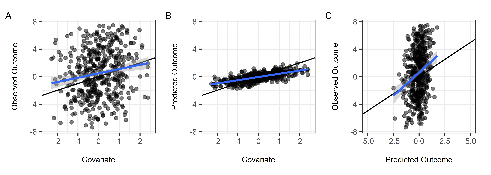

<!-- README.md is generated from README.Rmd. Please edit that file -->

# IPD: Inference on Predicted Data

<!-- badges: start -->

[](https://github.com/awanafiaz/IPD/actions/workflows/R-CMD-check.yaml)
<!-- badges: end -->

## 

With the rapid advancement of artificial intelligence and machine
learning (AI/ML), researchers from a wide range of disciplines
increasingly use predictions from pre-trained algorithms as outcome
variables in statistical analyses. However, reifying
algorithmically-derived values as measured outcomes may lead to biased
estimates and anti-conservative inference ([Hoffman et al.,
2023](https://arxiv.org/abs/2401.08702)). The statistical challenges
encountered when drawing inference on predicted data (IPD) include:

1.  Understanding the relationship between predicted outcomes and their
    true, unobserved counterparts
2.  Quantifying the robustness of the AI/ML models to resampling or
    uncertainty about the training data
3.  Appropriately propagating both bias and uncertainty from predictions
    into downstream inferential tasks

Several works have proposed methods for IPD, including post-prediction
inference (PostPI) by [Wang et al.,
2020](https://www.pnas.org/doi/suppl/10.1073/pnas.2001238117),
prediction-powered inference (PPI) and PPI++ by [Angelopoulos et al.,
2023a](https://www.science.org/doi/10.1126/science.adi6000) and
[Angelopoulos et al., 2023b](https://arxiv.org/abs/2311.01453), and
assumption-lean and data-adaptive post-prediction inference (POP-Inf) by
[Miao et al., 2023](https://arxiv.org/abs/2311.14220). To enable
researchers and practitioners interested in these state-of-the-art
methods, we have developed `IPD`, a open-source `R` package that
implements these methods under the umbrella of IPD.

This README provides an overview of the package, including installation
instructions, basic usage examples, and links to further documentation.
The examples show how to generate data, fit models, and use custom
methods provided by the package.

## Installation

To install the development version of `IPD` from
[GitHub](https://github.com/awanafiaz/IPD), you can use the `devtools`
package:

``` r
#-- Install devtools if it is not already installed

install.packages("devtools")   

#-- Install the IPD package from GitHub

devtools::install_github("awanafiaz/IPD")
```

## Usage

We provide a simple example to demonstrate the basic use of the
functions included in the `IPD` package.

### Example Setup

1.  We have two datasets: a labeled dataset,
    $\mathcal{L} = \left[Y^\mathcal{L}, X^\mathcal{L}, f\left(X^\mathcal{L}\right)\right]$,
    and an unlabeled dataset,
    $\left[X^\mathcal{U}, f\left(X^\mathcal{U}\right)\right]$. The
    labeled set is typically smaller in size compared to the unlabeled
    set.
2.  We have access to an algorithm $f(X)$ that can predict our outcome
    of interest $Y$.
3.  Our interest is in performing inference on a quantity such as the
    outcome mean or quantile, or to recover a downstream inferential
    (mean) model:

$$\mathbb{E}\left[Y^{\mathcal{U}} \mid \boldsymbol{X}^{\mathcal{U}}\right] = g^{-1}\left(\boldsymbol{X}^{\mathcal{U}'}\beta\right),$$

where $\beta$ is a vector of regression coefficients and $g(\cdot)$ is a
given link function, such as the identity link for linear regression,
the logistic link for logistic regression, or the log link for Poisson
regression. However, we do not observe $Y^\mathcal{U}$, only the
predicted $f(X^\mathcal{U})$. We can use methods for IPD to obtain
corrected estimates and standard errors when we replace these unobserved
$Y^\mathcal{U}$ by $f(X^\mathcal{U})$.

### Data Generation

You can generate synthetic datasets for different types of regression
models using the provided `simdat` function by specifying the sizes of
the datasets, the effect size, residual variance, and the type of model.
The function currently supports “mean”, “quantile”, “ols”, “logistic”,
and “poisson” models.

``` r
#-- Load the IPD Library

library(IPD)

#-- Generate Example Data for Linear Regression

set.seed(123)

n <- c(10000, 500, 1000)

dat <- simdat(n = n, effect = 3, sigma_Y = 1,

  model = "ols", shift = 1, scale = 2)

#-- Print First 6 Rows of Training, Labeled, and Unlabeled Subsets

options(digits=2)

head(dat[dat$set == "training",])
#>       X1    X2    X3     X4    Y  f      set
#> 1 -0.560 -0.56  0.82 -0.356 -1.3 NA training
#> 2 -0.230  0.13 -1.54  0.040 -2.7 NA training
#> 3  1.559  1.82 -0.59  1.152  5.4 NA training
#> 4  0.071  0.16 -0.18  1.485 -0.3 NA training
#> 5  0.129 -0.72 -0.71  0.634  1.1 NA training
#> 6  1.715  0.58 -0.54 -0.037  4.4 NA training

head(dat[dat$set == "labeled",])
#>          X1      X2    X3    X4    Y     f     set
#> 10001  2.37 -1.8984  0.20 -0.17  8.2  3.51 labeled
#> 10002 -0.17  1.7428  0.26 -2.05  2.4 -0.20 labeled
#> 10003  0.93 -1.0947  0.76  1.25  2.5  1.62 labeled
#> 10004 -0.57  0.1757  0.32  0.65 -1.6 -0.81 labeled
#> 10005  0.23  2.0620 -1.35  1.46  1.8 -0.42 labeled
#> 10006  1.13 -0.0028  0.23 -0.24  5.0  1.70 labeled

head(dat[dat$set == "unlabeled",])
#>          X1     X2    X3    X4     Y      f       set
#> 10501  0.99 -3.280 -0.39  0.97  9.02  1.140 unlabeled
#> 10502 -0.66  0.142 -1.36 -0.22 -4.22 -1.750 unlabeled
#> 10503  0.58 -1.368 -1.73  0.15  2.40 -0.094 unlabeled
#> 10504 -0.14 -0.728  0.26 -0.23 -1.23 -0.197 unlabeled
#> 10505 -0.17 -0.068 -1.10  0.58 -0.19 -0.897 unlabeled
#> 10506  0.58  0.514 -0.69  0.97  1.48  0.419 unlabeled
```

The `simdat` function provides observed and unobserved outcomes for both
the labeled and unlabeled datasets, though in practice the observed
outcomes are not in the unlabeled set. We can visualize the
relationships between these variables:



We can see that:

- The relationship between the true outcome and the covariate (plot A)
  is less variable than the relationship between the predicted outcome
  and the covariate (plot B)
- There is uncertainty in predicting the outcomes that needs to be
  accounted for (plot C)

### Model Fitting

We compare two non-`IPD` approaches to analyzing the data to methods
included in the `IPD` package.

#### 0.1 ‘Naive’ Regression Using the Predicted Outcomes

``` r
#--- Fit the Naive Regression

lm(f ~ X1, data = dat[dat$set == "unlabeled",]) |> 
  
  summary()
#> 
#> Call:
#> lm(formula = f ~ X1, data = dat[dat$set == "unlabeled", ])
#> 
#> Residuals:
#>     Min      1Q  Median      3Q     Max 
#> -1.2932 -0.3219 -0.0054  0.3220  1.4735 
#> 
#> Coefficients:
#>             Estimate Std. Error t value Pr(>|t|)    
#> (Intercept)  -0.1054     0.0152   -6.96  6.3e-12 ***
#> X1            1.4989     0.0151   99.34  < 2e-16 ***
#> ---
#> Signif. codes:  0 '***' 0.001 '**' 0.01 '*' 0.05 '.' 0.1 ' ' 1
#> 
#> Residual standard error: 0.48 on 998 degrees of freedom
#> Multiple R-squared:  0.908,  Adjusted R-squared:  0.908 
#> F-statistic: 9.87e+03 on 1 and 998 DF,  p-value: <2e-16
```

#### 0.2 ‘Classic’ Regression Using only the Labeled Data

``` r
#--- Fit the Classic Regression

lm(Y ~ X1, data = dat[dat$set == "labeled",]) |> 
  
  summary()
#> 
#> Call:
#> lm(formula = Y ~ X1, data = dat[dat$set == "labeled", ])
#> 
#> Residuals:
#>    Min     1Q Median     3Q    Max 
#> -8.506 -1.023  0.008  0.920  8.388 
#> 
#> Coefficients:
#>             Estimate Std. Error t value Pr(>|t|)    
#> (Intercept)   0.7792     0.0805    9.67   <2e-16 ***
#> X1            3.0190     0.0828   36.44   <2e-16 ***
#> ---
#> Signif. codes:  0 '***' 0.001 '**' 0.01 '*' 0.05 '.' 0.1 ' ' 1
#> 
#> Residual standard error: 1.8 on 498 degrees of freedom
#> Multiple R-squared:  0.727,  Adjusted R-squared:  0.727 
#> F-statistic: 1.33e+03 on 1 and 498 DF,  p-value: <2e-16
```

You can fit the various IPD methods to your data and obtain summaries
using the provided wrapper function, `ipd()`:

#### 1.1 PostPI Bootstrap Correction (Wang et al., 2020)

``` r
#-- Specify the Formula

formula <- Y - f ~ X1

#-- Fit the PostPI Bootstrap Correction

nboot <- 200

IPD::ipd(formula, 
         
  method = "postpi_boot", model = "ols", data = dat, label = "set", 
  
  nboot = nboot) |> 
  
  summary()
#> 
#> Call:
#>  Y - f ~ X1 
#> 
#> Method: postpi_boot 
#> Model: ols 
#> Intercept: Yes 
#> 
#> Coefficients:
#>             Estimate Std.Error Lower.CI Upper.CI
#> (Intercept)   0.7536    0.0722   0.6120     0.90
#> X1            3.0690    0.0720   2.9279     3.21
```

#### 1.2 PostPI Analytic Correction (Wang et al., 2020)

``` r
#-- Fit the PostPI Analytic Correction

IPD::ipd(formula, 
         
  method = "postpi_analytic", model = "ols", data = dat, label = "set") |> 
  
  summary()
#> 
#> Call:
#>  Y - f ~ X1 
#> 
#> Method: postpi_analytic 
#> Model: ols 
#> Intercept: Yes 
#> 
#> Coefficients:
#>             Estimate Std.Error Lower.CI Upper.CI
#> (Intercept)   0.7398    0.0722   0.5982     0.88
#> X1            3.0722    0.0719   2.9312     3.21
```

#### 2. Prediction-Powered Inference (PPI; Angelopoulos et al., 2023)

``` r
#-- Fit the PPI Correction

IPD::ipd(formula, 
         
  method = "ppi", model = "ols", data = dat, label = "set") |> 
  
  summary()
#> 
#> Call:
#>  Y - f ~ X1 
#> 
#> Method: ppi 
#> Model: ols 
#> Intercept: Yes 
#> 
#> Coefficients:
#>             Estimate Std.Error Lower.CI Upper.CI
#> (Intercept)   0.7605    0.0717   0.6200     0.90
#> X1            3.0316    0.0748   2.8849     3.18
```

#### 3. PPI++ (Angelopoulos et al., 2023)

``` r
#-- Fit the PPI++ Correction

IPD::ipd(formula, 
         
  method = "ppi_plusplus", model = "ols", data = dat, label = "set") |> 
  
  summary()
#> 
#> Call:
#>  Y - f ~ X1 
#> 
#> Method: ppi_plusplus 
#> Model: ols 
#> Intercept: Yes 
#> 
#> Coefficients:
#>             Estimate Std.Error Lower.CI Upper.CI
#> (Intercept)   0.7777    0.0798   0.6213     0.93
#> X1            3.0200    0.0811   2.8611     3.18
```

#### 4. Assumption-Lean and Data-Adaptive Post-Prediction Inference (POP-Inf; Miao et al., 2023)

``` r
#-- Fit the POP-Inf Correction

IPD::ipd(formula, 
         
  method = "popinf", model = "ols", data = dat, label = "set") |> 
  
  summary()
#> 
#> Call:
#>  Y - f ~ X1 
#> 
#> Method: popinf 
#> Model: ols 
#> Intercept: Yes 
#> 
#> Coefficients:
#>             Estimate Std.Error Lower.CI Upper.CI
#> (Intercept)   0.7766    0.0797   0.6203     0.93
#> X1            3.0197    0.0847   2.8537     3.19
```

### Printing and Tidying

The package also provides custom `print`, `summary`, `tidy`, `glance`,
and `augment` methods to facilitate easy model inspection:

``` r
#-- Fit the PostPI Bootstrap Correction

nboot <- 200

fit_postpi <- IPD::ipd(formula, 
         
  method = "postpi_boot", model = "ols", data = dat, label = "set", 
  
  nboot = nboot)
  
#-- Print the Model

print(fit_postpi)
#> 
#> Call:
#>  Y - f ~ X1 
#> 
#> Coefficients:
#> (Intercept)          X1 
#>        0.75        3.07

#-- Summarize the Model

summ_fit_postpi <- summary(fit_postpi)
  
#-- Print the Model Summary

print(summ_fit_postpi)
#> 
#> Call:
#>  Y - f ~ X1 
#> 
#> Method: postpi_boot 
#> Model: ols 
#> Intercept: Yes 
#> 
#> Coefficients:
#>             Estimate Std.Error Lower.CI Upper.CI
#> (Intercept)   0.7536    0.0722   0.6120     0.90
#> X1            3.0690    0.0720   2.9279     3.21

#-- Tidy the Model Output

tidy(fit_postpi)
#>                    term estimate std.error conf.low conf.high
#> (Intercept) (Intercept)     0.75     0.072     0.61       0.9
#> X1                   X1     3.07     0.072     2.93       3.2

#-- Get a One-Row Summary of the Model

glance(fit_postpi)
#>        method model intercept  nobs       call
#> 1 postpi_boot   ols      TRUE 11500 Y - f ~ X1

#-- Augment the Original Data with Fitted Values and Residuals

df <- dat[which(dat$set != "training"),]

augmented_df <- augment(fit_postpi, data = df)

head(augmented_df)
#>          X1      X2    X3    X4    Y     f     set .fitted .resid
#> 10001  2.37 -1.8984  0.20 -0.17  8.2  3.51 labeled    8.03   0.20
#> 10002 -0.17  1.7428  0.26 -2.05  2.4 -0.20 labeled    0.24   2.12
#> 10003  0.93 -1.0947  0.76  1.25  2.5  1.62 labeled    3.60  -1.11
#> 10004 -0.57  0.1757  0.32  0.65 -1.6 -0.81 labeled   -0.99  -0.61
#> 10005  0.23  2.0620 -1.35  1.46  1.8 -0.42 labeled    1.44   0.34
#> 10006  1.13 -0.0028  0.23 -0.24  5.0  1.70 labeled    4.23   0.72
```

## Vignette

For additional details, we provide more use cases and examples in the
package vignette:

``` r
vignette("ipd")
```

## Feedback

For questions, comments, or any other feedback, please contact the
developers at [ssalerno@fredhutch.org](ssalerno@fredhutch.org).

## Contributing

Contributions are welcome! Please open an issue or submit a pull request
on [GitHub](https://github.com/awanafiaz/IPD). The following
method/model combinations are currently implemented:

| Method                                                          | Mean Estimation    | Quantile Estimation | Linear Regression  | Logistic Regression | Poisson Regression | Multiclass Regression |
|-----------------------------------------------------------------|--------------------|---------------------|--------------------|---------------------|--------------------|-----------------------|
| [PostPI](https://www.pnas.org/doi/full/10.1073/pnas.2001238117) | :x:                | :x:                 | :white_check_mark: | :white_check_mark:  | :x:                | :x:                   |
| [PPI](https://www.science.org/doi/10.1126/science.adi6000)      | :white_check_mark: | :white_check_mark:  | :white_check_mark: | :white_check_mark:  | :x:                | :x:                   |
| [PPI++](https://arxiv.org/abs/2311.01453)                       | :white_check_mark: | :white_check_mark:  | :white_check_mark: | :white_check_mark:  | :x:                | :x:                   |
| [POP-Inf](https://arxiv.org/abs/2311.14220)                     | :white_check_mark: | :white_check_mark:  | :white_check_mark: | :white_check_mark:  | :white_check_mark: | :x:                   |
| [PSPS](https://arxiv.org/abs/2405.20039)                        | :x:                | :x:                 | :x:                | :x:                 | :x:                | :x:                   |
| [PDC](https://arxiv.org/abs/2312.06478)                         | :x:                | :x:                 | :x:                | :x:                 | :x:                | :x:                   |
| [Cross-PPI](https://www.pnas.org/doi/10.1073/pnas.2322083121)   | :x:                | :x:                 | :x:                | :x:                 | :x:                | :x:                   |
| [PPBoot](https://arxiv.org/abs/2405.18379)                      | :x:                | :x:                 | :x:                | :x:                 | :x:                | :x:                   |
| [DSL](https://arxiv.org/abs/2306.04746)                         | :x:                | :x:                 | :x:                | :x:                 | :x:                | :x:                   |

## License

This package is licensed under the MIT License.
